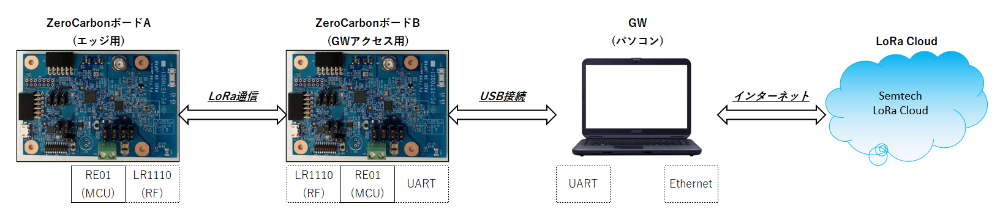
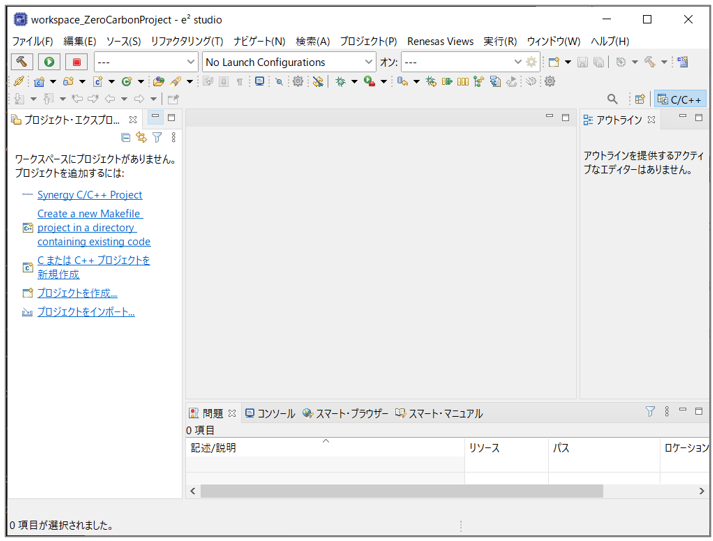

# ZeroCarbon LoRaⓇ Evaluation Board
# チュートリアル

<br>
<br>
<br>

## WifiスキャンとGNSS受信で独自屋内外トラッキング(LoRaクラウド利用)機能により、位置推定。また、センサ(SPI/I2C/※1)を追加する事でセンサデータを追加で取得可能。
##### ※1:温湿度センサ(HS3001)は標準搭載

<br>
目次

#### 0.システム構成
#### 1.機材準備(ハード)
#### 2.機材準備(ソフト)
#### 3.アカウント準備
#### 4.パソコン側アプリ環境構築
#### 5.ZeroCarbon LoRaⓇ Evaluation Board ジャンパSW等配置図
#### 6.LoRa LR1110デバイス ファームウェア更新(TX用ボード,RX用ボード共通)
#### 7.Renesas RE01マイコン ファームウェア更新(TX用ボード,RX用ボード共通)
#### 8.蓄電設定(TX用ボードのみ)
#### 9.RX接続設定(RX用ボードのみ)
#### 10.動かしてみよう
#### 11.トラブルシュート
#### 12.開発環境構築

<div style="page-break-before:always"></div>

## 0.システム構成


<br>

<div style="page-break-before:always"></div>

### 0-1. Link先  
| 関連章 | 対象 | LINK先 |
| ---- | ---- | ---- |
|2-1.| Renesas<br>RE01ﾏｲｺﾝ ﾌｧｰﾑｳｪｱ | [ZeroCarbon LoRaEva FW-Hex](https://github.com/ZeroCarbon-LoRaEva/FW-Hex)  |
||LoRa<br>LR1110ﾌｧｰﾑｳｪｱ<br>ｱｯﾌﾟﾃﾞｰﾄTool|  [ZeroCarbon LoRaEva Tool](https://github.com/ZeroCarbon-LoRaEva/Tool)  |
|2-2.| LoRa<br>LR1110ﾌｧｰﾑｳｪｱ | https://github.com/Lora-net/radio_firmware_images/tree/master/lr1110/transceiver |
|2-3.| Renesas<br>RE01ﾏｲｺﾝ ﾌｧｰﾑｳｪｱ<br>更新アプリ | [Renesas Flash Programmer (Programming GUI)](https://www.renesas.com/jp/ja/software-tool/renesas-flash-programmer-programming-gui) |
|4.| ﾊﾟｿｺﾝ側 ｱﾌﾟﾘ環境<br>構築資料 | [LR1110GeolocDemoUserGuide_v1.0.pdf](https://edit.wpgdadawant.com/uploads/news_file/program/2021/36422/tech_files/LR1110GeolocDemoUserGuide_v1.0.pdf)   |
|4-1.| ﾊﾟｿｺﾝ側 ｱﾌﾟﾘ環境<br>ﾊﾟｯｹｰｼﾞﾍﾞｰｽ | https://github.com/Lora-net/lr1110_evk_demo_app/wiki/Software-packages  |
|4-7.| ﾊﾟｿｺﾝ側 ｱﾌﾟﾘ環境<br>ﾊﾟｯｹｰｼﾞ | [ZeroCarbon LoRaEva lr1110 demo app](https://github.com/ZeroCarbon-LoRaEva/lr1110_evk_demo_app) |
||||
<br>

<div style="page-break-before:always"></div>

## 1.機材準備(ハード)
##### 1. ZeroCarbon LoRaⓇ Evaluation Board x 2(TX・RX用 各1枚)
##### 2. USB Type-A to microBケーブル x 2(TX[充電用]・RX[PC接続用])
##### 3. パソコン(アプリ動作[LoRaクラウド接続])
##### 4. インターネット接続環境(LoRaクラウド接続)
<br>

##### その他推奨品
| No. | 項目 | メーカ | 形式 |
| ---- | ---- | ---- | ---- |
| 1 | LoRa<br>LR1110用ダイポールアンテナ | Linx Technologies Inc. | ANT-916-CW-HWR-RPS-ND |
| 2 | ダイポールアンテナ変換ケーブル | アンテナテクノロジー | CSBMS156C-ANT-125N |
| 3 | GPS用アンテナ | Taoglas Limited | AA.170.301111 |
| 4 | 太陽光パネル(屋外用) | Panasonic | AM-1815CA |
| 5 | 太陽光パネル(室内用) | TDK | BCS4430B6 |
||||
<br>

<div style="page-break-before:always"></div>

## 2.機材準備(ソフト)
### 2-1. RE01マイコン用ファームウェア等をダウンロード(0-1.章より)する   
   1. TX用：ZeroCarbon_TxFW.hex
   2. RX用：ZeroCarbon_RxFW.hex
   3. LR1110ファームウェア更新用：ZeroCarbon_lr1110_FWupdate.hex
   4. LR1110ﾌｧｰﾑｳｪｱｱｯﾌﾟﾃﾞｰﾄTool：ZeroCarbon_lr1110_FWUpdater.exe
### 2-2. LR1110 ファームウェア Transceiver用をダウンロード(0-1.章より)する
   
   - バイナリーファイル(*.bin)とヘッダーファイル(*.h)がセットの為、両方ダウンロードします
   - ```※lr1110_transceiver_0306.bin / lr1110_transceiver_0306.h```
### 2-3. RE01マイコン ファームウェア更新用アプリ Renesas Flash Programmer(無償版)をダウンロード(0-1.章より)する

   - ```※要ユーザ登録```
<br>

<div style="page-break-before:always"></div>

## 3.アカウント準備
### 3-1. トラッキング(位置推定)用として、LoRa CLOUDにアカウント登録する
   - https://www.loracloud.com

   - ```※評価用としては、無料枠で利用できます```

### 3-2. GLS Tokenを以下 URLの Primary Tokenをコピーし、控えておく
   - https://www.loracloud.com/portal/geolocation/token_management


<br>

<div style="page-break-before:always"></div>

### 3-3. DAS Tokenを以下 URLで新規作成し、Tokenをコピーし、控えておく
   - https://www.loracloud.com/portal/device_management/tokens


<br>

<div style="page-break-before:always"></div>

## 4.パソコン側アプリ環境構築   
   - このソフトウェアを使用するには、最低でも**Python 3.5**が必要です   
   - 参考資料は以下URLにあります   
     - [LR1110GeolocDemoUserGuide_v1.0.pdf](https://edit.wpgdadawant.com/uploads/news_file/program/2021/36422/tech_files/LR1110GeolocDemoUserGuide_v1.0.pdf)   
     - 参照箇所は以下となります   	
       ```4.1.1 Ensure You Can Run Rython"pPythonで実行できる事を確認する"```から   
      ```4.3.2.1 Using The Usbconnectioncheck Software”Usbconnectioncheckソフトウェアの使用”```まで
### 4-1. 以下のURLから最新版(2021.10.27時点 Version3.1.0)をダウンロード(0-1.章より)する
   ```
   lr1110_evk_demo_app_v3.1.0.zip
   ```
### 4-2. ダウンロードファイル(lr1110_evk_demo_app_v3.1.0.zip)をローカルに解凍する  
   ```
   lr1110_evk_v3.1.0.bin  
   lr1110evk-3.1.0.tar.gz
   ```
### 4-3. コマンドプロンプトを起動する  
### 4-4. lr1110evk-3.1.0.tar.gz の保存フォルダより、以下コマンドを実行する  
   ```
   > python -m pip install --user --upgrade setuptools wheel

   > pip install lr1110evk-3.1.0.tar.gz
   ```
### 4-5. 以下コマンドでVersionを確認する  
   ```
   > lr1110demo --version  
   
   > usbconnectioncheck --version
   ```
<br>

<div style="page-break-before:always"></div>

### 4-6. 以下のフォルダを削除後する
   ```
   C:\Users\xxxxxx\AppData\Local\Programs\Python\Python39\Lib\site-packages\lr1110evk  
   ```
   - ```※"xxxxxx"はユーザ名```   
   
### 4-7. 以下のURLからルネサス用最新版 lr1110evk をパソコン内の以下パスにダウンロード(0-1.章より)する  
   リストボックス"Code"内の"Download ZIP"を選択し、ダウンロードする
   lr1110_evk_demo_app-master.zipファイルを解凍する
   "lr1110_evk_demo_app-master\host"フォルダ内にある"lr1110evk"フォルダを以下フォルダにコピーする
   ```
   C:\Users\xxxxxx\AppData\Local\Programs\Python\Python39\Lib\site-packages
   ```
   - ```※"xxxxxx"はユーザ名```
### 4-8. 上記のダウンロードしたファイルを解凍する  
   - ```※フォルダ名が二重にならない様に注意する```
<br>

<div style="page-break-before:always"></div>

## 5.ZeroCarbon LoRaⓇ Evaluation Board ジャンパSW等配置図
  
- JPスイッチ設定

- 塗りつぶし部分がshort or 1-2接続 or 2-3接続となります 
- a.エネハベ素子蓄電　設定
   
- b.USB経由高速蓄電　設定
   
- c.USB給電　設定
   
- d.RFP書き込み(RE01書換)＆給電　設定
＆給電.png)   
- e.LR1110 FW書き込み(USB通信)＆給電　設定
＆給電.png)
- f.USB通信(RX用)＆給電　設定
＆給電.png)   
<br>

<div style="page-break-before:always"></div>

## 6.LoRa LR1110 ファームウェア更新(TX用ボード,RX用ボード共通)
### 6-1. 先ず、```2-1.3 LR1110ファームウェア更新用``` でRE01マイコンを更新する   
- JP/SW設定は```5.d. RFP書き込み(RE01書換)＆給電``` とする   
- パソコンとボードを USB接続する   
- ```2-2 RFP(Renesas Flash Programmer)``` を起動し、```2-1.3 LR1110ファームウェア更新用``` で更新する   
   - タグ"接続設定"内の"ツール詳細"で接続したCOMポートを選択   
   - タグ"操作"内、"プログラムファイル"の"参照"にて ```2-1.3 LR1110ファームウェア更新用``` を選択   
   - "フラッシュ操作"の"スタート"ボタンを押下   
     ```※エラーとなった場合、ボードのResetボタンを押下直後に"スタート"ボタンを押下```
       
<br>

<div style="page-break-before:always"></div>

### 6-2. ```2-2 LR1110ファームウェア``` で LR1110デバイスを更新する   
- JP/SW設定は ```5.e. LR1110 FW書き込み(USB通信)＆給電``` とする   
- パソコンとボードを USB接続する   
- ```2-1.4 LR1110ファームウェア更新アプリ``` を起動し、```2-2 LR1110ファームウェア``` で更新する   
   - 接続したCOMポートを選択   
   - ```2-2 LR1110ファームウェア``` の .bin/.hファイル を選択   
   - "Update"ボタンを押下
      
<br>

<div style="page-break-before:always"></div>

## 7.Renesas RE01 ファームウェア更新(TX用ボード,RX用ボード共用)   
- JP/SW設定は ```5.d. RFP書き込み(RE01書換)＆給電``` とする   
- パソコンとボードを USB接続する   
- ```2-3 RFP(Renesas Flash Programmer)``` を起動し、```2-1.1 TX用 or 2-1.2 RX用``` で更新する   
   - タグ"接続設定"内の"ツール詳細"で接続したCOMポートを選択   
   - タグ"操作"内、"プログラムファイル"の"参照"にて ```2-1.1 TX用 or 2-1.2 RX用```  を選択   
   - "フラッシュ操作"の"スタート"ボタンを押下   
   ```※エラーとなった場合、ボードのResetボタンを押下直後に"スタート"ボタンを押下``` 
    
<br>

<div style="page-break-before:always"></div>

## 8.蓄電設定(TX用ボードのみ)   
### 8-1. エネハベ素子蓄電(ソーラーパネルによる二次電池への蓄電)   
   - TX用ボードにソーラーパネルを接続(+,-端子を間違わないように)   
   - JP/SW設定は ```5.a. エネハベ素子蓄電``` とする   
   ```※二次電池への蓄電には時間が掛かります```    
   
### 8-2. USB経由高速蓄電(USB給電による二次電池への蓄電)   
   - JP/SW設定は ```5.b. USB経由高速蓄電``` とする   
   - TX用ボードにPC接続済みUSBを接続   
<br>

## 9.RX接続設定(RX用ボードのみ)   
### 9-1. パソコンとのシリアル通信接続、及びUSB給電   
   - JP/SW設定は ```5.f. USB通信&給電(RX用)``` とする 
   - RX用ボードにPC接続済みUSBを接続    
<br>

<div style="page-break-before:always"></div>

## 10.動かしてみよう   
### 10-1. ```4.パソコン側アプリ環境構築``` で設定した LR1110ディレクトリに移動して下記を実行   
```   
> Lr1110Demo -d <COM_PORT> <COORDINATES_ASSISTED_LR1110> <COORDINATES_EXACT> <GLS TOKEN> <DAS TOKEN>
```   
(コマンド例)   
```
> Lr1110Demo -d COM4 34.70210993807373,135.4958717974474,1 34.64588733864984,135.51443499143957,17 Ayyyyyyyyyyyyyyyyyyyyyyyyyyyyyyyyy/Dqsd AyyyyyyyyyyyyyyyyyyyyyyyyyyyyyyyyyYPT
```
   - ```<COM_PORT>```   
      RX用ボードが接続されているPCのポート番号   
   - ```<COORDINATES_ASSISTED_LR1110>```   
      RX用ボードが設置されている場所の 緯度・経度・高度を googleマップ内で右クリックし取得したモノを使用   
   - ```<COORDINATES_EXACT>```   
      RX用ボードから数10km離れた場所の 緯度・経度・高度を googleマップ内で右クリックし取得したモノを使用   
   - ```<GLS TOKEN>```   
      ``` 3.2 GLS Token``` で取得したモノを使用    
   - ```<DAS TOKEN>```   
      ```3.3 DAS Token``` で取得したモノを使用    

(実行例)   
```
C:\Users\xxxxxx\AppData\Local\Programs\Python\Python39\Lib\site-packages\lr1110evk> Lr1110Demo -d /dev/ttyUSB0 34.68892,135.47446,1 34.69820,135.59746,1 Ayyyyyyyyyyyyyyyyyyyyyyyyyyyyyyyyy/Dqsd AyyyyyyyyyyyyyyyyyyyyyyyyyyyyyyyyyYPT
GNSS Demo Start
Command (1 .. Start without Almanac, 2 .. Download Almanac, 3 .. End Program) :
```   

   - ```※"xxxxxx"はユーザ名```   
   - "1 .. Start without Almanac, 2 .. Download Almanac, 3 .. End Program" は "1" を選択    
<br>

<div style="page-break-before:always"></div>

### 10-2. TX用ボードを操作する   
- 起動30秒経過後   
- トリガーSWを押下する   
   TX用ボード、RX用ボード(パソコン)、LoRaクラウドでやり取りをおこない、位置推定を算出する   
   (通信時間は約30秒)   

(例）実行後、以下のログが表示される
```   

DATE :  2022-01-08 13:02:50.275376
gTemp    =  23.55
gHumi    =  39.37
gLati    =  34.690048
gLong    =  135.533182
gEdgerssi=  -9.0
gGwrssi  =  -10.0
gWifi    =  4

```
   - gLati とgLong の部分が緯度経度となる   
   - "34.690048" と "135.533182" を "34.690048,135.533182" の様にカンマで区切り、[Googleマップ](https://www.google.co.jp/maps)の左上の"Google マップを検索する"欄に入力し、Enterにて取得した緯度経度が表示されます   
<br>

<div style="page-break-before:always"></div>

## 11.トラブルシュート   
### 11-1. pythonのバージョンが3.5以上にならない
OS 環境変数 Pathがインストールしたpythonのパスを通していない
- コントロールパネル > システム > システムの詳細設定 > 環境変数 > 変数Pathを編集
- パスは以下を追加し、一覧の上位から参照される為、"上へ"ボタンで上位に移動させる
C:\Users\xxxxxxx\AppData\Local\Programs\Python\Python39\Scripts\
C:\Users\xxxxxxx\AppData\Local\Programs\Python\Python39\
    
<br>

<div style="page-break-before:always"></div>

## 12.開発環境構築   
### 12-1. Link先
| No. | 対象 | LINK先 |
| ---- | ---- | ---- |
| ①| ZeroCarbonProject<br>Patch データ | https://github.com/ZeroCarbon-LoRaEva/ZeroCarbonProjectPatch |
| ②| renesas<br>ドライバパッケージ | https://github.com/ZeroCarbon-LoRaEva/re-driver-package |
| ③| LoRa®<br>lr1110 EVK デモアプリ | https://github.com/ZeroCarbon-LoRaEva/lr1110_evk_demo_app |
| ④| LoRa®<br>lr1110ドライバ | https://github.com/ZeroCarbon-LoRaEva/lr1110_driver/tree/Branch_v3.0.0_kai |
| ⑤| LoRa®<br>lr1110モデムドライバ | https://github.com/ZeroCarbon-LoRaEva/lr1110_modem_driver/tree/Branch_v2.0.1_kai |
||||
<br>

### 12-2. ```12-1. Link先```のGitからコードをダウンロード、解凍する
- 各URL先内のリストボックス"Code"内の"Download ZIP"を選択しダウンロード
- 解凍する(以下のフォルダが生成される)
①ZeroCarbonProjectPatch-main
②re-driver-package-master
③lr1110_evk_demo_app-master
④lr1110_driver-Branch_v3.0.0_kai
⑤lr1110_modem_driver-Branch_v2.0.1_kai
<br>

<div style="page-break-before:always"></div>

### 12-3. RenesasのWebからベースとなるプロジェクトをダウンロード、解凍する
- 以下のURL先からダウンロード
[Application Note RE01 256KB グループ バッテリメンテナンスフリーを実現するエナジハーベスト LoRaWAN®センサ](https://www.renesas.com/jp/ja/document/scd/re01-256kb-group-battery-maintenance-free-lorawan-sensor-energy-harvesting-application-note-rev100?language=en&r=1321781)
- ダウンロードした```r01an5753xx0100-re-lora.zip```を解凍
   
- 解凍した```r01an5753_re_lora.zip```を解凍
   
- 今回用にフォルダ名を変更する

```r01an5753_re_lora```⇒```ZeroCarbonProject```
<br>

<div style="page-break-before:always"></div>

### 12-4. ZeroCarbonProjectフォルダにPatch情報データを適用する
ダウンロード解凍フォルダ：```①ZeroCarbonProjectPatch-main```
適用先フォルダ：```ZeroCarbonProject```
patch情報ファイル：```0001-FileAndFolder-delete.patch``` / ```0002-ZeroCarbon-Custom.patch```
- patch情報ファイルを```ZeroCarbonProject```フォルダと同列にコピーする
- コマンドプロンプトを立ち上げ、```cd```コマンドで```ZeroCarbonProject```フォルダに移動する
- 以下コマンドを実行する
```
> patch --directory=ZeroCarbonProject -p1 --verbose --remove-empty-files < 0001-FileAndFolder-delete.patch

> patch --directory=ZeroCarbonProject -p1 --verbose --remove-empty-files < 0002-ZeroCarbon-Custom.patch
```
```※patchコマンドはWindowsでは未実装の為、Windows版のpatchコマンドを入手する```
<br>

### 12-5. ZeroCarbonProjectフォルダにダウンロードしたコードで書き換える
#### 12-5-1. ダウンロード解凍フォルダ：```②re-driver-package-master```
```re-driver-package-master\SDK_RE01_256KB\RE01_256KB_DFP```
上記フォルダ内の以下フォルダを```ZeroCarbonProject```フォルダにコピー、上書きする	
- ```CMSIS```
- ```config```
- ```Device```
- ```script```
- ```SVD```
#### 12-5-2. ダウンロード解凍フォルダ：```③lr1110_evk_demo_app-master```
```lr1110_evk_demo_app-master\embedded```
上記フォルダ内の以下フォルダを```ZeroCarbonProject```フォルダにコピー、上書きする	
- ```application```
- ```demo```
- ```system```
#### 12-5-3. ダウンロード解凍フォルダ：```④lr1110_driver-Branch_v3.0.0_kai```
```lr1110_driver-6.0.0```
上記フォルダを```ZeroCarbonProject```フォルダにコピー、下記のフォルダ名に変更する	
- ```lr1110_driver```
<br>

<div style="page-break-before:always"></div>

#### 12-5-4. ダウンロード解凍フォルダ：```⑤lr1110_modem_driver-Branch_v2.0.1_kai```
```lr1110_modem_driver-Branch_v2.0.1_kai```
上記フォルダを```ZeroCarbonProject```フォルダにコピー、下記のフォルダ名に変更する	
- ```lr1110_modem_driver```
<br>

### 12-6. 統合開発環境e2studioをインストールする
Renesasサイトよりダウンロードし、インストールする
<br>

### 12-7. 統合開発環境e2studioに```ZeroCarbonProject```をインポートし、Buildする
- e2studioを起動する
- ワークスペースディレクトリを指定、起動する

- ```ログ/使用状況データ収集```は```キャンセル```ボタン押下
- ```Renesas Welcome to e2studio```は```ようこそ```横の```x```を押下
- プロジェクト・エクスプローラー内の```プロジェクトをインポート```を選択


<div style="page-break-before:always"></div>

- ```一般```の```既存プロジェクトをワークスペースへ```を選択し、```次へ```押下


<div style="page-break-before:always"></div>

- ```ルート・ディレクトリの選択(T)```の```参照```ボタン押下し、```12-5.章```迄で作成したプロジェクトフォルダを指定し、```終了```ボタン押下


<div style="page-break-before:always"></div>

- プロジェクト・エクスプローラー内の```LR1110_GNSS_256KB_Transceiver```を右クリックで```プロジェクトのビルド(B)```を選択


<div style="page-break-before:always"></div>

- ウィンドウ右下タグ内の```コンソール```に```Build Finished 0 error, 0 warnings```が表示されればビルド成功

- ```.hex```ファイルは以下フォルダに生成される
```ZeroCarbonProject\HardwareDebug\LR1110_GNSS_256KB_Transceiver.hex```
<br>

<div style="page-break-before:always"></div>

### 12-8. ZeroCarbon RE01のTXボード用 / RXボード用のファームウェアを作成する場合、以下の定義を変更し、Buildする事で生成できる
- 編集するファイルは```ZeroCarbonProject```フォルダ直下の```config_mode.h```
- TXボード用は以下の設定とする
```
#define TRACKER_RX_TX_UPDATE (2)
#define GNSS_ANTENNA_ACTIVE (1)
#define SEND_TO_SERVER (0)
```
- RXボード用は以下の設定とする
```
#define TRACKER_RX_TX_UPDATE (1))
#define GNSS_ANTENNA_ACTIVE (0)
#define SEND_TO_SERVER (1)
```

