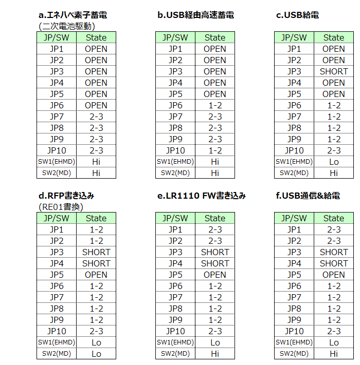
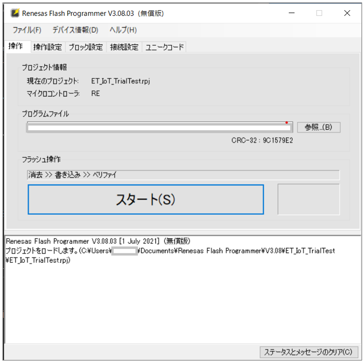
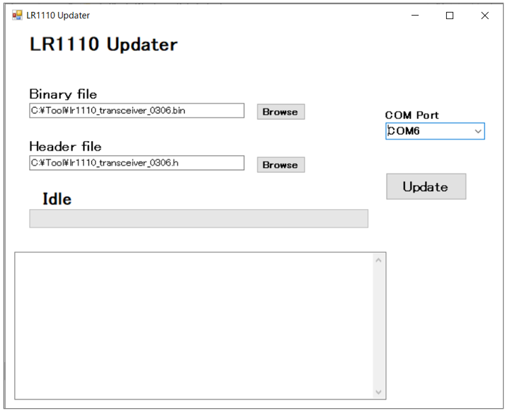
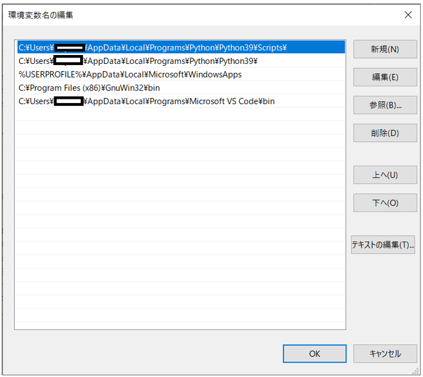
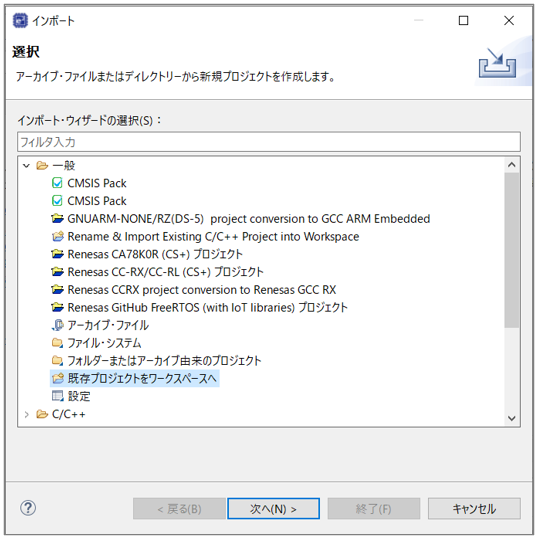
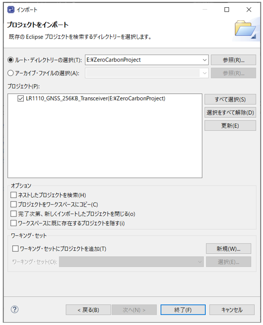
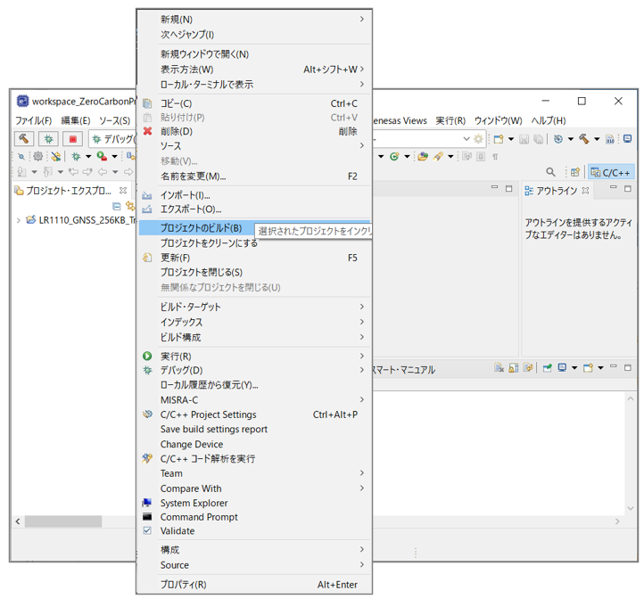
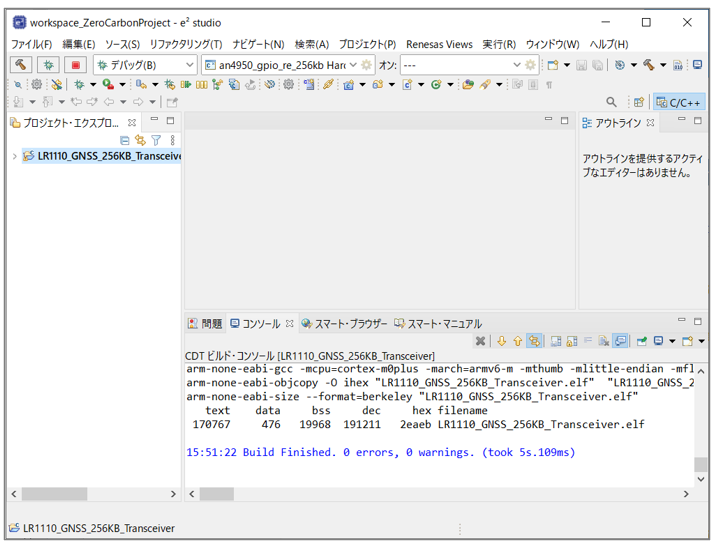
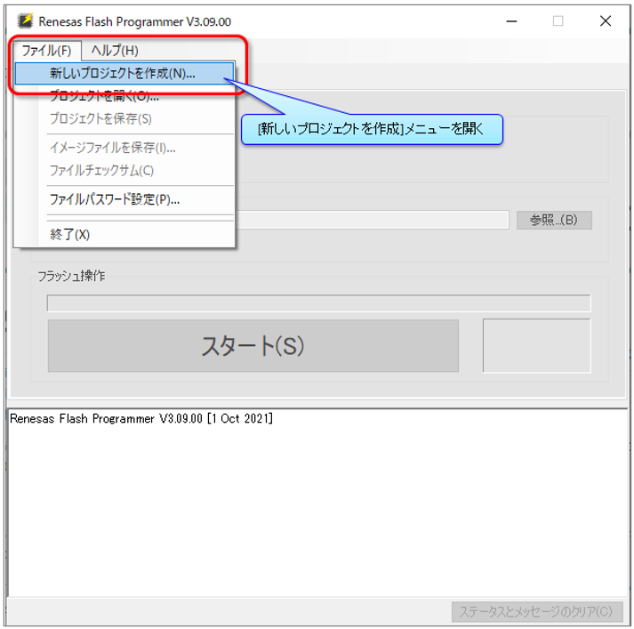
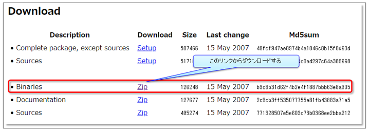

# ZeroCarbon LoRaⓇ Evaluation Board
# チュートリアル

<br>
<br>
<br>

## WifiスキャンとGNSS受信で独自屋内外トラッキング(LoRaクラウド※1)機能により、位置(緯度経度)を推定。また、センサ(SPI/I2C/※2)を追加する事でセンサデータを追加で取得可能。 <!-- omit in toc -->

**※1:利用手順・動作について、メーカ(SEMTECH)推奨とは異なる場合が有ります**
**※2:温湿度センサ(HS3001)は標準搭載**

<br>

## 目次 <!-- omit in toc -->


- [0.システム構成](#0システム構成)
- [1.機材準備(ハード)](#1機材準備ハード)
- [2.機材準備(ソフト)](#2機材準備ソフト)
- [3.アカウント準備](#3アカウント準備)
- [4.パソコン側アプリ環境構築](#4パソコン側アプリ環境構築)
- [5.ZeroCarbon LoRaⓇ Evaluation Board ジャンパSW等配置図](#5zerocarbon-lora-evaluation-board-ジャンパsw等配置図)
- [6.LoRa LR1110 ファームウェア更新(TX用ボード,RX用ボード共通)](#6lora-lr1110-ファームウェア更新tx用ボードrx用ボード共通)
- [7.Renesas RE01 ファームウェア更新(TX用ボード,RX用ボード共用)](#7renesas-re01-ファームウェア更新tx用ボードrx用ボード共用)
- [8.蓄電設定(TX用ボードのみ)](#8蓄電設定tx用ボードのみ)
- [9.RX接続設定(RX用ボードのみ)](#9rx接続設定rx用ボードのみ)
- [10.動かしてみよう](#10動かしてみよう)
- [11.トラブルシュート](#11トラブルシュート)
- [12.開発環境構築](#12開発環境構築)
- [13. Renesas Flash Programmer のプロジェクト作成](#13-renesas-flash-programmer-のプロジェクト作成)
- [14. patch コマンドについて](#14-patch-コマンドについて)


<div style="page-break-before:always"></div>

## 0.システム構成


<br>

<div style="page-break-before:always"></div>

### 0-1. Link先  

| 関連章 | 対象 | LINK先 |
| ---- | ---- | ---- |
|2-1.| Renesas<br>RE01ﾏｲｺﾝ ﾌｧｰﾑｳｪｱ | [ZeroCarbon LoRaEva FW-Hex](https://github.com/ZeroCarbon-LoRaEva/FW-Hex)  |
||LoRa<br>LR1110ﾌｧｰﾑｳｪｱ<br>ｱｯﾌﾟﾃﾞｰﾄTool|  [ZeroCarbon LoRaEva Tool](https://github.com/ZeroCarbon-LoRaEva/Tool)  |
|2-2.| LoRa<br>LR1110ﾌｧｰﾑｳｪｱ | https://github.com/Lora-net/radio_firmware_images/tree/master/lr1110/transceiver |
|2-3.| Renesas<br>RE01ﾏｲｺﾝ ﾌｧｰﾑｳｪｱ<br>更新アプリ | [Renesas Flash Programmer (Programming GUI)](https://www.renesas.com/jp/ja/software-tool/renesas-flash-programmer-programming-gui) |
|4.| ﾊﾟｿｺﾝ側 ｱﾌﾟﾘ環境<br>構築資料 | [LR1110GeolocDemoUserGuide_v1.0.pdf](https://edit.wpgdadawant.com/uploads/news_file/program/2021/36422/tech_files/LR1110GeolocDemoUserGuide_v1.0.pdf)   |
|4-1.| ﾊﾟｿｺﾝ側 ｱﾌﾟﾘ環境<br>ﾊﾟｯｹｰｼﾞﾍﾞｰｽ | https://github.com/Lora-net/lr1110_evk_demo_app/wiki/Software-packages  |
|4-7.| ﾊﾟｿｺﾝ側 ｱﾌﾟﾘ環境<br>ﾊﾟｯｹｰｼﾞ | [ZeroCarbon LoRaEva lr1110 demo app](https://github.com/ZeroCarbon-LoRaEva/lr1110_evk_demo_app) |

<br>

<div style="page-break-before:always"></div>

## 1.機材準備(ハード)

##### 1. ZeroCarbon LoRaⓇ Evaluation Board x 2(TX・RX用 各1枚)
##### 2. USB Type-A to microBケーブル x 2(TX[充電用]・RX[PC接続用])
##### 3. パソコン(アプリ動作[LoRaクラウド接続])
##### 4. インターネット接続環境(LoRaクラウド接続)
<br>

##### その他推奨品
| No. | 項目 | メーカ | 形式 |
| ---- | ---- | ---- | ---- |
| 1 | LoRa<br>LR1110用ダイポールアンテナ | Linx Technologies Inc. | ANT-916-CW-HWR-RPS-ND |
| 2 | ダイポールアンテナ変換ケーブル | アンテナテクノロジー | CSBMS156C-ANT-125N |
| 3 | GPS用アンテナ | Taoglas Limited | AA.170.301111 |
| 4 | 太陽光パネル(屋外用) | Panasonic | AM-1815CA |
| 5 | 太陽光パネル(室内用) | TDK | BCS4430B6 |

<br>

<div style="page-break-before:always"></div>

## 2.機材準備(ソフト)
### 2-1. RE01マイコン用ファームウェア等をからダウンロードする([0-1. Link先](#0-1-link先))

   1. TX用：ZeroCarbon_TxFW.hex
   2. RX用：ZeroCarbon_RxFW.hex
   3. LR1110ファームウェア更新用：ZeroCarbon_lr1110_FWupdate.hex
   4. LR1110ﾌｧｰﾑｳｪｱｱｯﾌﾟﾃﾞｰﾄTool：ZeroCarbon_lr1110_FWUpdater.exe
### 2-2. LR1110 ファームウェア Transceiver用をダウンロードする([0-1. Link先](#0-1-link先))
   
バイナリーファイル(*.bin)とヘッダーファイル(*.h)がセットの為、両方ダウンロードします。

   - lr1110_transceiver_0307.bin
   - lr1110_transceiver_0307.h

__※新しいバージョンのものがあるかもしれませんが、0307 をダウンロードしてください。__
### 2-3. RE01マイコン ファームウェア更新用アプリ Renesas Flash Programmer をダウンロードする([0-1. Link先](#0-1-link先))

   - ```※要ユーザ登録```

<br>

<div style="page-break-before:always"></div>

## 3.アカウント準備
### 3-1. トラッキング(位置推定)用として、LoRa CLOUDにアカウント登録する

   - https://www.loracloud.com  
   `※評価用としては、無料枠で利用できます`

### 3-2. 所有者を新規作成する

- https://www.loracloud.com/portal
#### 3-2-1 "Modem & Geolocation Services"を押下
   

#### 3-2-2 "DEVICE OWNERS"を押下
   

<br>


<div style="page-break-before:always"></div>

#### 3-2-3 "CREATE NEW OWNER"にて、所有者を作成
   

#### 3-2-4 "NAME"欄に所有者を入力し、ボタン押下
   

<br>


<div style="page-break-before:always"></div>

#### 3-2-5 所有者が追加
   

<br>


<div style="page-break-before:always"></div>

### 3-3. Manage Tokenを新規作成し、Manege Tokenを控える

- https://www.loracloud.com/portal/modem_services/tokens
#### 3-3-1 "MANAGE TOKENS"を押下
   

#### 3-3-2 3-2-5で追加した所有者名を選択
   

<br>


<div style="page-break-before:always"></div>

#### 3-3-3 "CREATE NEW TOKEN"にて、TOKENを作成
   

#### 3-3-4 "NAME"欄にTOKEN名を入力・権限を設定し、ボタンを押下
   

<br>


<div style="page-break-before:always"></div>

#### 3-3-5 MANAGE TOKENが作成されるので、"Copy"ボタンを押してTokenコードをクリップボードにコピーする
   

<br>


<div style="page-break-before:always"></div>

## 4.パソコン側アプリ環境構築   

   - このソフトウェアを使用するには、最低でも**Python 3.5**が必要です  
   - 参考資料は以下URLにあります   
     - [LR1110GeolocDemoUserGuide_v1.0.pdf](https://edit.wpgdadawant.com/uploads/news_file/program/2021/36422/tech_files/LR1110GeolocDemoUserGuide_v1.0.pdf)
     - 参照箇所は以下となります   	
       ```4.1.1 Ensure You Can Run Rython"pPythonで実行できる事を確認する```から   
      ```4.3.2.1 Using The Usbconnectioncheck Software”Usbconnectioncheckソフトウェアの使用```まで
### 4-1. パソコン側アプリ環境パッケージベースをダウンロードする

 [0-1. Link先](#0-1-link先) に記載のURLから次の **Version3.1.0** の Software package をダウンロードする。
 
※[LR1110GeolocDemoUserGuide_v1.0.pdf](https://edit.wpgdadawant.com/uploads/news_file/program/2021/36422/tech_files/LR1110GeolocDemoUserGuide_v1.0.pdf)の「3 LR1110 EVK Software Package」にURLが記載されていますが、 [0-1. Link先](#0-1-link先) に記載のリンクからダウンロードするようにしてください。

   ```
   lr1110_evk_demo_app_v3.1.0.zip
   ```
### 4-2. ダウンロードファイル(lr1110_evk_demo_app_v3.1.0.zip)をローカルに解凍する  
   ```
   lr1110_evk_v3.1.0.bin  
   lr1110evk-3.1.0.tar.gz
   ```
### 4-3. コマンドプロンプトを起動する  
### 4-4. lr1110evk-3.1.0.tar.gz の保存フォルダより、以下コマンドを実行する  
   ```
   > python -m pip install --user --upgrade setuptools wheel

   > pip install lr1110evk-3.1.0.tar.gz
   ```
### 4-5. 以下コマンドでVersionを確認する  
   ```
   > lr1110demo --version  
   
   > usbconnectioncheck --version
   ```
<br>

<div style="page-break-before:always"></div>

### 4-6. 以下のフォルダを削除

   ```
   C:\Users\xxxxxx\AppData\Local\Programs\Python\PythonXX\Lib\site-packages\lr1110evk  
   ```
   - `※"xxxxxx"はユーザ名`
   - `※"PythonXX" は使用する Python のバージョンに合わせて読み替える`  
     例) Python 3.10.x 使用時は Python310

### 4-7. ルネサス用最新版 lr1110evk をダウンロード

[0-1. Link先](#0-1-link先) に記載のURLからパソコン側アプリ環境パッケージをダウンロードする。

- リストボックス"Code"内の"Download ZIP"を選択し、ダウンロードする
- lr1110_evk_demo_app-master.zipファイルを解凍する
- "lr1110_evk_demo_app-master\host"フォルダ内にある"lr1110evk"フォルダを以下フォルダにコピーする

   ```
   C:\Users\xxxxxx\AppData\Local\Programs\Python\PythonXX\Lib\site-packages
   ```
   - `※"xxxxxx"はユーザ名`
   - `※"PythonXX" は使用する Python のバージョンに合わせて読み替える`  
     例) Python 3.10.x 使用時は Python310

<br>

<div style="page-break-before:always"></div>

## 5.ZeroCarbon LoRaⓇ Evaluation Board ジャンパSW等配置図
  
- JPスイッチ設定

- 塗りつぶし部分がshort or 1-2接続 or 2-3接続となります 
- a.エネハベ素子蓄電　設定
   
- b.USB経由高速蓄電　設定
   
- c.USB給電　設定
   
- d.RFP書き込み(RE01書換)＆給電　設定
＆給電.png)   
- e.LR1110 FW書き込み(USB通信)＆給電　設定
＆給電.png)
- f.USB通信(RX用)＆給電　設定
＆給電.png)   
<br>

<div style="page-break-before:always"></div>

## 6.LoRa LR1110 ファームウェア更新(TX用ボード,RX用ボード共通)

※ Renesas Flash Programmer を使用して初めてファームウェア更新を行う場合は [13. Renesas Flash Programmer のプロジェクト作成](#13-renesas-flash-programmer-のプロジェクト作成) を参照して初期設定を行っておく。
### 6-1. 先ず、```2-1.3 LR1110ファームウェア更新用``` でRE01マイコンを更新する   
- JP/SW設定は```5.d. RFP書き込み(RE01書換)＆給電``` とする   
- パソコンとボードを USB接続する   
- ```2-2 RFP(Renesas Flash Programmer)``` を起動し、```2-1.3 LR1110ファームウェア更新用``` で更新する   
   - タグ"接続設定"内の"ツール詳細"で接続したCOMポートを選択   
   - タグ"操作"内、"プログラムファイル"の"参照"にて ```2-1.3 LR1110ファームウェア更新用``` を選択   
   - "フラッシュ操作"の"スタート"ボタンを押下   
     ```※エラーとなった場合、ボードのResetボタンを押下直後に"スタート"ボタンを押下```

   

<br>

<div style="page-break-before:always"></div>

### 6-2. ```2-2 LR1110ファームウェア``` で LR1110デバイスを更新する   
- JP/SW設定は ```5.e. LR1110 FW書き込み(USB通信)＆給電``` とする   
- パソコンとボードを USB接続する   
- ```2-1.4 LR1110ファームウェア更新アプリ``` を起動し、```2-2 LR1110ファームウェア``` で更新する   
   - 接続したCOMポートを選択   
   - ```2-2 LR1110ファームウェア``` の .bin/.hファイル を選択   
   - "Update"ボタンを押下

      

<br>

<div style="page-break-before:always"></div>

## 7.Renesas RE01 ファームウェア更新(TX用ボード,RX用ボード共用)   
- JP/SW設定は ```5.d. RFP書き込み(RE01書換)＆給電``` とする   
- パソコンとボードを USB接続する   
- ```2-3 RFP(Renesas Flash Programmer)``` を起動し、```2-1.1 TX用 or 2-1.2 RX用``` で更新する   
   - タグ"接続設定"内の"ツール詳細"で接続したCOMポートを選択   
   - タグ"操作"内、"プログラムファイル"の"参照"にて ```2-1.1 TX用 or 2-1.2 RX用```  を選択   
   - "フラッシュ操作"の"スタート"ボタンを押下   
   ```※エラーとなった場合、ボードのResetボタンを押下直後に"スタート"ボタンを押下``` 

   

<br>

<div style="page-break-before:always"></div>

## 8.蓄電設定(TX用ボードのみ)   
### 8-1. エネハベ素子蓄電(ソーラーパネルによる二次電池への蓄電)   
   - TX用ボードにソーラーパネルを接続(+,-端子を間違わないように)   
   - JP/SW設定は ```5.a. エネハベ素子蓄電``` とする   
   ```※二次電池への蓄電には時間が掛かります```    
   
### 8-2. USB経由高速蓄電(USB給電による二次電池への蓄電)   
   - JP/SW設定は ```5.b. USB経由高速蓄電``` とする   
   - TX用ボードにPC接続済みUSBを接続   
<br>

## 9.RX接続設定(RX用ボードのみ)   
### 9-1. パソコンとのシリアル通信接続、及びUSB給電   
   - JP/SW設定は ```5.f. USB通信&給電(RX用)``` とする 
   - RX用ボードにPC接続済みUSBを接続    
<br>

<div style="page-break-before:always"></div>

## 10.動かしてみよう   
### 10-1. ```4.パソコン側アプリ環境構築``` で設定した LR1110ディレクトリに移動して下記を実行   
```   
> Lr1110Demo -d <COM_PORT> <COORDINATES_ASSISTED_LR1110> <COORDINATES_EXACT> <MANAGE TOKEN>
```   
(コマンド例)   
```
> Lr1110Demo -d COM4 34.70210993807373,135.4958717974474,1 34.64588733864984,135.51443499143957,17 Ayyyyyyyyyyyyyyyyyyyyyyyyyyyyyyyyy
```
   - ```<COM_PORT>```   
      RX用ボードが接続されているPCのポート番号   
   - ```<COORDINATES_ASSISTED_LR1110>```   
      RX用ボードが設置されている場所の 緯度・経度・高度を指定  
      書式は `緯度,経度,高度`  
      緯度、経度は googleマップ内で右クリックすることで取得可能  
      高度は googleマップからは取得できないため任意の値を指定
   - ```<COORDINATES_EXACT>```   
      RX用ボードから数10km離れた場所の 緯度・経度・高度を指定  
      指定方法は `COORDINATES_ASSISTED_LR1110` と同様
   - ```<MANAGE TOKEN>```   
      ``` 3-3-5``` で取得した MANAGE TOKENを使用    

(実行例)   
```
> Lr1110Demo -d COM4 34.70210993807373,135.4958717974474,1 34.64588733864984,135.51443499143957,17 Ayyyyyyyyyyyyyyyyyyyyyyyyyyyyyyyyy
GNSS Demo Start
Command (1 .. Start without Almanac, 2 .. Download Almanac, 3 .. End Program) :1
Test Host handler
Reply3 b'demooglog\r\x00'
```   
※```"Command (1 .. Start without Almanac, 2 .. Download Almanac, 3 .. End Program) :"```は
"1 .. Start without Almanac"の"1"を選択する


<br>

<div style="page-break-before:always"></div>

### 10-2. TX用ボードを操作する   
- 起動30秒経過後   
- トリガーSWを押下する   
   TX用ボード、RX用ボード(パソコン)、LoRaクラウドでやり取りをおこない、位置推定を算出する   
   (通信時間は約30秒)   

(例）実行後、以下のログ例が表示される
   - Wifi APによる緯度経度算出時
```   
DATE :  2022-mm-dd 11:52:08.589493
gTemp    =  26.19
gHumi    =  61.67
gLati    =  34.690048
gLong    =  135.533182
gEdgerssi=  -29.0
gGwrssi  =  -31.0
gWifi    =  6
gGnss    =  0
```
   - GNSSによる緯度経度算出時
```   
DATE :  2022-mm-dd 13:46:26.000950
gTemp    =  26.72
gHumi    =  60.83
gLati    =  34.69021
gLong    =  135.5343
gEdgerssi=  -99.0
gGwrssi  =  -102.0
gWifi    =  0
gGnss    =  18
```
   - gLati とgLong の部分が緯度経度となる   
   - "34.690048" と "135.533182" を "34.690048,135.533182" の様にカンマで区切り、[Googleマップ](https://www.google.co.jp/maps)の左上の"Google マップを検索する"欄に入力し、Enterにて取得した緯度経度が表示されます   
<br>

<div style="page-break-before:always"></div>

## 11.トラブルシュート   
### 11-1. pythonのバージョンが3.5以上にならない
OS 環境変数 Pathがインストールしたpythonのパスを通していない
- コントロールパネル > システム > システムの詳細設定 > 環境変数 > 変数Pathを編集
- パスは以下を追加し、一覧の上位から参照される為、"上へ"ボタンで上位に移動させる
   C:\Users\xxxxxxx\AppData\Local\Programs\Python\Python39\Scripts\
   C:\Users\xxxxxxx\AppData\Local\Programs\Python\Python39\
   ※Python3.9系 の場合

       

<br>

<div style="page-break-before:always"></div>

## 12.開発環境構築   
### 12-1. Link先
| No. | 対象 | LINK先 |
| ---- | ---- | ---- |
| ①| ZeroCarbonProject<br>Patch データ | https://github.com/ZeroCarbon-LoRaEva/ZeroCarbonProjectPatch |
| ②| renesas<br>ドライバパッケージ | https://github.com/ZeroCarbon-LoRaEva/re-driver-package |
| ③| LoRa®<br>lr1110 EVK デモアプリ | https://github.com/ZeroCarbon-LoRaEva/lr1110_evk_demo_app |
| ④| LoRa®<br>lr1110ドライバ | https://github.com/ZeroCarbon-LoRaEva/lr1110_driver/tree/Branch_v3.0.0_kai |
| ⑤| LoRa®<br>lr1110モデムドライバ | https://github.com/ZeroCarbon-LoRaEva/lr1110_modem_driver/tree/Branch_v2.0.1_kai |

<br>

### 12-2. ```12-1. Link先```のGitからコードをダウンロード、解凍する
- 各URL先内のリストボックス"Code"内の"Download ZIP"を選択しダウンロード
- 解凍する(以下のフォルダが生成される)

   - ①ZeroCarbonProjectPatch-main
   - ②re-driver-package-master
   - ③lr1110_evk_demo_app-master
   - ④lr1110_driver-Branch_v3.0.0_kai
   - ⑤lr1110_modem_driver-Branch_v2.0.1_kai


<div style="page-break-before:always"></div>

### 12-3. RenesasのWebからベースとなるプロジェクトをダウンロード、解凍する
- 以下のURL先からダウンロード  
   [Application Note RE01 256KB グループ バッテリメンテナンスフリーを実現するエナジハーベスト LoRaWAN®センサ](https://www.renesas.com/jp/ja/document/scd/re01-256kb-group-battery-maintenance-free-lorawan-sensor-energy-harvesting-application-note-rev100?language=en&r=1321781)

- ダウンロードした```r01an5753xx0100-re-lora.zip```を解凍  
   **※フォルダパスに空白文字や全角文字が含まれているとビルドエラーになるため解凍先に注意してください。**

      

- `r01an5753_re_lora.zip`を解凍

      

- 今回用にフォルダ名を変更する

   `r01an5753_re_lora`⇒`ZeroCarbonProject`

<br>

<div style="page-break-before:always"></div>

### 12-4. ZeroCarbonProjectフォルダにPatch情報データを適用する

- ダウンロード解凍フォルダ：```①ZeroCarbonProjectPatch-main```
- 適用先フォルダ：```ZeroCarbonProject```
- patch情報ファイル： ```0001-FileAndFolder-delete.patch``` / ```0002-ZeroCarbon-Custom.patch```

1. patch情報ファイルを`ZeroCarbonProject`フォルダと同列にコピーする
2. コマンドプロンプトを立ち上げ、`cd`コマンドで`ZeroCarbonProject`フォルダと同じフォルダへ移動する
3. 以下コマンドを実行する

   ```
   > patch --directory=ZeroCarbonProject -p1 --verbose --remove-empty-files < 0001-FileAndFolder-delete.patch

   > patch --directory=ZeroCarbonProject -p1 --verbose --remove-empty-files < 0002-ZeroCarbon-Custom.patch
   ```
   ※Windows にはデフォルトでは `patch` コマンドがないため [14. patch コマンドについて](#14-patch-コマンドについて)を参照して用意してください。
   ※この patch コマンドは Windows の制約により、管理者権限でのコマンドプロンプト上でなければ実行できません。

<br>

### 12-5. ZeroCarbonProjectフォルダにダウンロードしたコードで書き換える
#### 12-5-1. ダウンロード解凍フォルダ：```②re-driver-package-master```

`re-driver-package-master\SDK_RE01_256KB\RE01_256KB_DFP`

上記フォルダ内の以下フォルダを```ZeroCarbonProject```フォルダにコピー、上書きする	

- ```CMSIS```
- ```config```
- ```Device```
- ```script```
- ```SVD```

<br>

<div style="page-break-before:always"></div>

#### 12-5-2. ダウンロード解凍フォルダ：```③lr1110_evk_demo_app-master```

`lr1110_evk_demo_app-master\embedded`

上記フォルダ内の以下フォルダを```ZeroCarbonProject```フォルダにコピー、上書きする	

- ```application```
- ```demo```
- ```system```

#### 12-5-3. ダウンロード解凍フォルダ：```④lr1110_driver-Branch_v3.0.0_kai```

`lr1110_driver-Branch_v3.0.0_kai`

上記フォルダを```ZeroCarbonProject```フォルダにコピー、下記のフォルダ名に変更する	

- ```lr1110_driver```

#### 12-5-4. ダウンロード解凍フォルダ：```⑤lr1110_modem_driver-Branch_v2.0.1_kai```

`lr1110_modem_driver-Branch_v2.0.1_kai`

上記フォルダを```ZeroCarbonProject```フォルダにコピー、下記のフォルダ名に変更する	

- ```lr1110_modem_driver```

<br>

<div style="page-break-before:always"></div>

### 12-6. 統合開発環境e2studioをインストールする
Renesasサイトよりダウンロードし、インストールする
<br>

### 12-7. 統合開発環境e2studioに```ZeroCarbonProject```をインポートし、Buildする

- e2studioを起動する
- ワークスペースディレクトリを指定、起動する

   

- ```ログ/使用状況データ収集```は```キャンセル```ボタン押下
- ```Renesas Welcome to e2studio```は```ようこそ```横の```x```を押下

- プロジェクト・エクスプローラー内の```プロジェクトをインポート```を選択

   

<div style="page-break-before:always"></div>

- ```一般```の```既存プロジェクトをワークスペースへ```を選択し、```次へ```押下

   

- ```ルート・ディレクトリの選択(T)```の```参照```ボタン押下し、```12-5.章```迄で作成したプロジェクトフォルダを指定し、```終了```ボタン押下

   

<div style="page-break-before:always"></div>

- プロジェクト・エクスプローラー内の```LR1110_GNSS_256KB_Transceiver```を右クリックで```プロジェクトのビルド(B)```を選択

   

- ウィンドウ右下タグ内の```コンソール```に```Build Finished 0 error, 0 warnings```が表示されればビルド成功

   

- ```.hex```ファイルは以下フォルダに生成される
```ZeroCarbonProject\HardwareDebug\LR1110_GNSS_256KB_Transceiver.hex```

<br>

<div style="page-break-before:always"></div>

### 12-8. ZeroCarbon RE01のTXボード用 / RXボード用のファームウェアを作成する場合、以下の定義を変更し、Buildする事で生成できる
- 編集するファイルは```ZeroCarbonProject```フォルダ直下の```config_mode.h```
- TXボード用は以下の設定とする

   ```c
   #define TRACKER_RX_TX_UPDATE (2)
   #define GNSS_ANTENNA_ACTIVE (1)
   #define SEND_TO_SERVER (0)
   ```

- RXボード用は以下の設定とする

   ```c
   #define TRACKER_RX_TX_UPDATE (1)
   #define GNSS_ANTENNA_ACTIVE (0)
   #define SEND_TO_SERVER (1)
   ```

<div style="page-break-before:always"></div>

## 13. Renesas Flash Programmer のプロジェクト作成

1. JP/SW設定は `5.e. LR1110 FW書き込み(USB通信)＆給電` とする
2. ZeroCarbon LoRaⓇ Evaluation Board をUSBケーブルでPCに接続する
3. Renesas Flash Programmer の起動

   

4. 新しいプロジェクトの作成

   

<div style="page-break-before:always"></div>

5. プロジェクトの設定

   

6. ポート選択

   

<div style="page-break-before:always"></div>

7. 接続

   ZeroCarbon LoRaⓇ Evaluation Board のリセットSWを押下して、直後に[接続]ボタンを押下する。

   

8. 接続結果確認

   

<div style="page-break-before:always"></div>

## 14. patch コマンドについて

Windows にはデフォルトでは `patch` コマンドがないため、別途インストールする必要があります。

Windows 用 patch コマンドは次のWEBサイトなどから取得することができます。

- [Patch for Windows](http://gnuwin32.sourceforge.net/packages/patch.htm)

   

   ダウンロードした zip ファイルを任意のフォルダに解凍してください。

   **この patch コマンドは Windows の制約により、管理者権限でのコマンドプロンプト上でなければ実行できません。**

patch コマンドを実行する際は次のコマンドを実行して patch.exe のパスを登録しておく必要があります。

   ```cmd
   > set PATH=%PATH%;"<patchコマンド解凍フォルダ>\patch-2.5.9-7-bin\bin"
   ```
